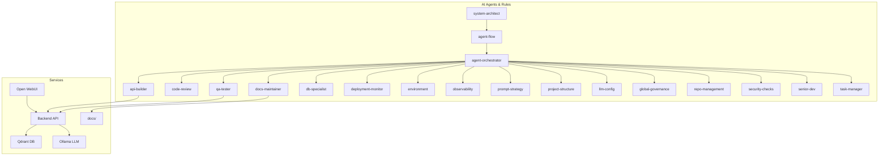

# Planning & Roadmap

## 🎯 Project Vision
PDF Chat Appliance aims to be the most user-friendly, self-hosted AI solution for querying personal PDF collections with enterprise-grade reliability and extensibility.

## 🏗️ Architecture Principles
1. **Modularity**: Clear separation of concerns with pluggable components
2. **Extensibility**: Easy to swap LLMs, vector DBs, and add new features
3. **User Experience**: Simple CLI and WebUI for different user types
4. **Production Ready**: Proper error handling, logging, and monitoring
5. **Privacy First**: All processing happens locally by default
6. **Performance Optimized**: CPU-efficient processing for large documents

## 📋 Current Architecture

### Core Components
- **`pdfchat/`**: Main package with modular components
- **`pdfchat.py`**: CLI entrypoint using Typer
- **`config/`**: Configuration management
- **`tests/`**: Comprehensive test suite
- **`docs/`**: User and developer documentation
- **`scripts/`**: Performance optimization and batch processing tools

### Data Flow
1. PDF Ingestion → Chunking → Embedding → Qdrant Storage
2. Query → Embedding → Similarity Search → LLM Response
3. API/CLI/WebUI → Unified Backend → Response

### Optimized Ingestion Pipeline (v1.3.0)
**CPU-Only Model Strategy:**
- **Chunking**: `phi3:cpu` for intelligent document parsing
- **Embedding**: `all-MiniLM-L6-v2` via HuggingFace for dense vectors
- **Storage**: Qdrant with optimized collection management
- **Performance**: Modular ingestion (1 PDF = 1 cycle) with detailed timing

**Performance Monitoring:**
- Total chunk time per document
- Total embedding time per document
- Total tokens processed
- Memory usage tracking
- Logs stored in `logs/perf/*.md`

## 🧠 Agent-Based Development

This project uses autonomous AI agents powered by `.cursor/rules/*.mdc` files.  
Each agent governs a specific domain (e.g., code review, model config, test enforcement) and operates under the supervision of `agent-flow.mdc` and `global-governance.mdc`.

**Agent Roles:**
- `system-architect`: Manages flow, folder structure, and architecture
- `task-manager`: Tracks task assignment and status via `TASK.md`
- `rule-governor`: Creates and formats `.mdc` rules based on new domains
- `agent-orchestrator`: Detects flow violations and execution drift
- `llm-specialist`: Optimizes model selection and performance tuning
- `observability`: Performance monitoring and logging
- All agents listed in `RULES_INDEX.md`

All execution is governed in AUTO mode. Agents reference `llm-config.mdc`, `project-structure.mdc`, and `coding-style.mdc` to operate safely.

---

## 🧩 Agile Workflow & Agent System

All work in this project is gated by status fields and `.mdc` agent rules for safety, compliance, and quality:

- **No code, docs, or data change is permitted unless:**
  - PRD and Architecture are `status: approved`
  - Epic and Story are in the correct status (`current`, `in-progress`)
  - Agent and workflow gating is satisfied (see `workflow-pdfchat.mdc`)
- The agent system (see [RULES_INDEX.md](RULES_INDEX.md)) automates:
  - Code review, testing, deployment, logging, and security checks
  - Task assignment and tracking
  - Docs and onboarding
  - Compliance, escalation, and audit logging

### Agent Onboarding/Contribution

- New agents or rules must be:
  - Proposed by `system-architect`
  - Created by `rule-governor`
  - Logged in `TASK.md` by `task-manager`
  - Indexed in [RULES_INDEX.md](RULES_INDEX.md)
- New human contributors should read [README.md](README.md) for setup and agent execution details.

### Architecture & Agent Data Flow (Mermaid)

---

## 🚀 Future Roadmap

### Phase 1: Core Stability (v1.1.0) ✅ COMPLETED
- [x] `observability` Add comprehensive logging
- [x] `qa-tester`, `core` Implement proper error handling and recovery
- [x] `system-architect` Add configuration validation
- [x] `docs-maintainer` Create deployment guides (Docker, OVA, Proxmox)
- [x] `docs-maintainer` Add WebUI with file upload interface

### Phase 2: Enhanced Features (v1.2.0) ✅ COMPLETED
- [x] `llm-specialist`, `llm-config` Ollama integration for local LLM inference
- [x] `data-cleaner` (optional) Support for multiple document formats (DOCX, TXT, etc.)
- [x] `api-builder` Batch processing capabilities
- [x] `qa-tester` Advanced query options (filters, date ranges)
- [x] `docs-maintainer` Export/import functionality

### Phase 3: Performance Optimization (v1.3.0) 🟡 IN PROGRESS
- [x] `llm-specialist` CPU-only model optimization for large documents
- [x] `api-builder` Modular ingestion pipeline with timing
- [x] `observability` Performance monitoring and benchmarking
- [ ] `qa-tester` Large document testing (8000+ pages)
- [ ] `docs-maintainer` Performance optimization guides
- [ ] `system-architect` Chunk flow routing optimization

### Phase 4: Enterprise Features (v2.0.0)
- [ ] 🟡 `auth-handler` (optional) Multi-user support with authentication
- [ ] 🟡 `access-policy-agent` (optional) Role-based access control
- [x] `observability`, `repo-management` Audit logging and compliance
- [x] `system-architect` High availability and clustering design
- [x] `api-builder`, `rate-limiter-agent` API rate limiting and quotas

### Phase 5: AI Enhancement (v2.1.0)
- [x] `llm-specialist` Multi-modal support (images, tables)
- [x] `llm-specialist` Advanced RAG techniques
- [x] `llm-specialist`, `db-specialist` Custom embedding models
- [x] `llm-specialist` Fine-tuning capabilities
- [x] `session-coordinator` (optional) Conversation memory and context

---

## 🔧 Technical Decisions

### Technology Stack
- **Python 3.9+**: Modern Python with type hints
- **llama-index**: Document processing and RAG
- **Qdrant**: Vector database for embeddings (replaced ChromaDB)
- **Flask**: Lightweight web framework
- **Typer**: Modern CLI framework
- **PyYAML**: Configuration management
- **HuggingFace**: CPU-optimized embedding models

### Performance Optimization
- **CPU Models**: `phi3:cpu`, `mistral:cpu`, `llama2:7b:cpu`
- **Embedding**: `all-MiniLM-L6-v2` for dense, fast embeddings
- **Chunking**: Semantic chunking with overlap for context preservation
- **Storage**: Qdrant with optimized collection management
- **Monitoring**: Detailed performance logging in `logs/perf/`

### Design Patterns
- **Factory Pattern**: For creating different LLM/embedding backends
- **Strategy Pattern**: For different query strategies
- **Observer Pattern**: For logging and monitoring
- **Repository Pattern**: For data access abstraction
- **Pipeline Pattern**: For modular document processing

---

## 📊 Success Metrics
- **Usability**: Time to first successful query < 5 minutes
- **Performance**: Query response time < 3 seconds
- **Ingestion**: Large document processing < 10 minutes per 1000 pages
- **Reliability**: 99.9% uptime for production deployments
- **Extensibility**: New LLM integration in < 1 day
- **Community**: 100+ GitHub stars within 6 months

---

## 🤝 Contributing Guidelines
- Follow the role-based collaboration model in `session_notes.md`
- All new features require tests and documentation
- Use conventional commit messages
- Maintain backward compatibility within major versions
- Performance optimizations must include benchmarking

---

## 🔁 Optional Future Agents

These agents may be added by `rule-governor.mdc` as the system evolves:

- `frontend-review.mdc`: If UI becomes complex
- `auth-handler.mdc`: For user sessions, login, RBAC
- `analytics-agent.mdc`: For usage tracking or reporting
- `data-cleaner.mdc`: For format validation and parsing
- `rate-limiter-agent.mdc`: To protect APIs or plugins
- `session-coordinator.mdc`: For persistent memory across chat sessions
- `performance-monitor.mdc`: For real-time performance tracking

All new agent creation must follow the policies in `global-governance.mdc`.

