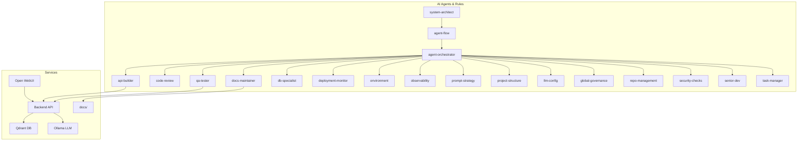

# PDF Chat Appliance

## 🦾 Mission
A production-ready, self-hosted document chat appliance using Open WebUI as the frontend interface. Features multi-document support, local LLM processing, and vector search capabilities. Built for privacy, speed, and extensibility.

---

## ✨ Features
- **Open WebUI Frontend:** Modern chat interface at `http://localhost:8080`
- **Multi-Document Support:** PDF, TXT, MD, DOCX, CSV, RTF file processing
- **Local LLM Processing:** Ollama with Mistral model for chat, nomic-embed-text-v1.5 for embeddings
- **Vector Database:** Qdrant for high-performance semantic search
- **Backend API:** RESTful document processing service
- **Docker Orchestration:** Complete containerized stack
- **Self-Contained:** Runs entirely on local infrastructure
- **Multi-Agent Development:** Fully autonomous AI agents for development, QA, monitoring, and governance

---

## 🚀 Quick Start

### Prerequisites
- Docker and Docker Compose
- 8GB+ RAM recommended
- 15GB+ disk space for models and documents
- If running on Windows:
  - PowerShell must allow script execution for automation scripts like `agent-run.ps1`
  - Open PowerShell as Administrator and run:
    ```powershell
    Set-ExecutionPolicy Unrestricted -Scope LocalMachine
    ```
  - This allows autonomous agents to execute management scripts without interruption.

### Steps
1. Clone the repo:
   ```sh
   git clone https://github.com/your-org/pdf-chat-appliance.git
   cd pdf-chat-appliance
   ```
2. Start the complete stack:
   ```sh
   docker-compose up -d
   ```
3. Access Open WebUI:
   - Open `http://localhost:8080` in your browser
   - Upload documents and start chatting!

---

## 🧠 Autonomous Agent System

### Architecture (Mermaid Diagram)


### How it works:
- **Agents** enforce agile workflow, code quality, docs, infra, and security through `.mdc` rules in `.cursor/rules/`.
- **Workflow is gated:**  
  PRD/architecture must be `approved`, only one epic/story is active at a time, agents can't skip or duplicate work.
- **Execution is fully autonomous:**  
  No user confirmation needed; agents coordinate, audit, and block unsafe changes using your `settings.json` and `.mdc` rules.
- **Transparent and extensible:**  
  See [`RULES_INDEX.md`](RULES_INDEX.md) for a full agent list and responsibilities.

---

## ⚙️ System Services

### Services
- **Open WebUI** (`localhost:8080`): Primary frontend interface
- **Ollama** (`localhost:11434`): Local LLM and embeddings
- **Qdrant** (`localhost:6333`): Vector database for semantic search
- **Backend API** (`localhost:5000`): Document processing service
- **Nginx** (`localhost:80/443`): Reverse proxy (optional)

### Data Flow
1. Upload documents via Open WebUI
2. Backend processes and creates embeddings using nomic-embed-text-v1.5
3. Documents stored in Qdrant vector database
4. Chat queries retrieve relevant context
5. Ollama (Mistral) generates responses based on document content

---

## 📝 Usage

### Open WebUI (Primary Interface)
- **Access:** `http://localhost:8080`
- **Features:** Upload documents, chat with content, manage conversations
- **Supported Formats:** PDF, TXT, MD, DOCX, CSV, RTF

### Backend API (For Integration)
- **Health Check:** `GET http://localhost:5000/health`
- **Document Upload:** `POST http://localhost:5000/upload`
- **Document Query:** `POST http://localhost:5000/query`
- **Get Context:** `POST http://localhost:5000/context`

### CLI Management
```sh
# Ingest documents (inside container)
docker exec pdf-chat-appliance python pdfchat.py ingest documents

# Check container logs
docker logs pdf-chat-appliance
```

---

## 🧠 Long-Term Memory & Persistence
PDF Chat Appliance supports persistent storage of user interactions, conversation history, and document insights across sessions.

- **Backends:**
  - Default: SQLite (local, file-based)
  - Extensible: PostgreSQL, ChromaDB, JSONL (future)
- **Data Stored:**
  - User sessions, Q&A pairs, document insights, and logs
- **Location:**
  - All persistent data is stored in the `/data/` directory (configurable)
- **Configuration:**
  - Backend and data path can be set in `config.py` or via CLI
- **API:**
  - Unified memory API for CRUD and search operations

See [docs/memory.md](docs/memory.md) for details and developer onboarding.

---

## 📦 Deployment

### Docker (Recommended)
```bash
# Start all services
docker-compose up -d

# View logs
docker-compose logs -f

# Stop services
docker-compose down
```

---

## 📝 Documentation
- [Usage Guide](docs/usage.md)
- [Architecture Overview](docs/architecture.md)
- [Configuration Guide](docs/configuration.md)
- [Deployment Guide](docs/deployment.md)
- [Manual Installation Guide](docs/manual-install.md)
- [Long-Term Memory & Persistence](docs/memory.md)
- [Agent Rules Index](RULES_INDEX.md)

---

## 🛠️ Installation Options

### Quick Start (OVA)
1. Download the OVA file
2. Import into VMware/VirtualBox/Proxmox
3. Start VM and access at `http://<VM_IP>`

### Manual Installation
For custom deployments or testing, see our [Manual Installation Guide](docs/manual-install.md) for step-by-step instructions on:
- VM creation (VMware, VirtualBox, Proxmox)
- Ubuntu 22.04/24.04 installation
- Python environment setup
- Ollama installation and configuration
- Service configuration and testing

### Docker
```bash
git clone https://github.com/your-org/pdf-chat-appliance.git
cd pdf-chat-appliance
docker-compose up --build
```

---

## 👥 Credits & License
- Built by the open-source community
- Licensed under MIT (see LICENSE)
