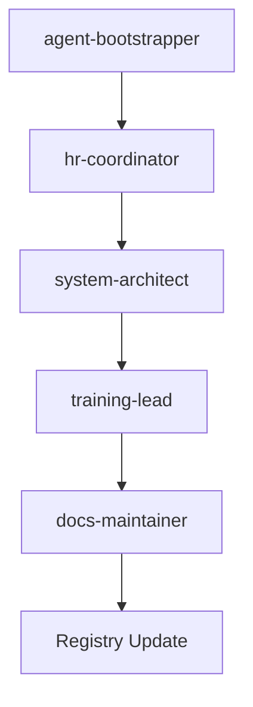

# RUNN.md - Global Agent Registry

> Managed by `hr-coordinator` agent  
> Last updated: 2025-07-06  
> Status: Active

## Global Agent Registry

This is the central registry for all agents across all projects in the organization. The registry is maintained by the `hr-coordinator` agent and serves as the authoritative source for agent assignments, status, and capabilities.

## Registry Structure

### Project-Based Organization

#### PDF Chat Appliance Project
- **Location**: `/pdf-chat-appliance`
- **Status**: Active
- **Focus**: PDF processing, RAG implementation, enterprise deployment

#### Future Projects (Planned)
- **Proxmox Build Project**: Infrastructure automation and deployment
- **Windows 11 Performance Project**: System optimization and performance tuning

### Agent Categories

#### Core Project Agents
Agents dedicated to specific project needs and workflows.

#### Shared Agents (agent-core/)
Cross-project agents that serve multiple projects and provide core infrastructure.

#### Temporary Agents
Short-term agents for specific needs, trials, or experimental work.

## Active Agent Registry

### PDF Chat Appliance Project Agents

| Agent | Status | Specialization | Location | Dependencies |
|-------|--------|----------------|----------|--------------|
| system-architect | Active | Architecture design, technical planning | .cursor/rules/ | hr-coordinator, training-lead |
| api-builder | Active | FastAPI development, API optimization | .cursor/rules/ | system-architect, qa-tester |
| llm-specialist | Active | LLM integration, RAG optimization | .cursor/rules/ | system-architect, db-specialist |
| db-specialist | Active | Database design, vector store management | .cursor/rules/ | system-architect, python-engineer |
| python-engineer | Active | Core Python development, refactoring | .cursor/rules/ | code-review, qa-tester |
| code-review | Active | Code quality, review processes | .cursor/rules/ | coding-style, qa-tester |
| qa-tester | Active | Testing, quality assurance | .cursor/rules/ | observability, deployment-monitor |
| docs-maintainer | Active | Documentation, knowledge management | .cursor/rules/ | project-structure, rule-governor |
| deployment-monitor | Active | Deployment, infrastructure monitoring | .cursor/rules/ | observability, security-checks |
| observability | Active | System monitoring, performance tracking | .cursor/rules/ | deployment-monitor, qa-tester |
| security-checks | Active | Security validation, compliance | .cursor/rules/ | global-governance, rule-governor |
| senior-dev | Active | Complex refactoring, architectural migrations | .cursor/rules/ | system-architect, code-review |
| task-manager | Active | Agile workflow, task tracking | .cursor/rules/ | agent-flow, agent-orchestrator |
| agent-flow | Active | Workflow orchestration, agent coordination | .cursor/rules/ | agent-orchestrator, rule-governor |
| agent-orchestrator | Active | High-level agent coordination, planning | .cursor/rules/ | hr-coordinator, global-governance |
| rule-governor | Active | Agent rule validation, governance | .cursor/rules/ | global-governance, hr-coordinator |
| global-governance | Active | Global policy, compliance oversight | .cursor/rules/ | hr-coordinator, security-checks |
| project-structure | Active | Repository structure, organization | .cursor/rules/ | rule-governor, docs-maintainer |
| prompt-strategy | Active | Prompt engineering, optimization | .cursor/rules/ | llm-specialist, qa-tester |
| repo-management | Active | Version control, repository management | .cursor/rules/ | project-structure, security-checks |
| coding-style | Active | Code formatting, style enforcement | .cursor/rules/ | code-review, python-engineer |
| environment | Active | Environment setup, management | .cursor/rules/ | deployment-monitor, observability |
| llm-config | Active | LLM configuration, model management | .cursor/rules/ | llm-specialist, system-architect |
| workflow-pdfchat | Active | PDF chat specific workflow management | .cursor/rules/ | agent-flow, task-manager |

### Shared Agents (agent-core/)

| Agent | Status | Specialization | Location | Dependencies |
|-------|--------|----------------|----------|--------------|
| hr-coordinator | Active | Agent onboarding, lifecycle tracking | .cursor/rules/ | global-governance |
| training-lead | Active | Agent training, skill development | .cursor/rules/ | hr-coordinator, docs-maintainer |
| agent-bootstrapper | Active | New agent creation, initialization | .cursor/rules/ | hr-coordinator, system-architect |

## Agent Capabilities Matrix

### Core Competencies

| Competency | Primary Agents | Supporting Agents |
|------------|----------------|-------------------|
| Architecture Design | system-architect | senior-dev, global-governance |
| API Development | api-builder | python-engineer, qa-tester |
| LLM Integration | llm-specialist | llm-config, prompt-strategy |
| Database Management | db-specialist | python-engineer, observability |
| Code Quality | code-review, coding-style | qa-tester, python-engineer |
| Testing & QA | qa-tester | observability, deployment-monitor |
| Documentation | docs-maintainer | project-structure, rule-governor |
| Deployment | deployment-monitor | observability, security-checks |
| Monitoring | observability | deployment-monitor, qa-tester |
| Security | security-checks | global-governance, rule-governor |
| Workflow Management | agent-flow, task-manager | agent-orchestrator, rule-governor |
| Governance | rule-governor, global-governance | hr-coordinator, security-checks |

## Agent Lifecycle Management

### Onboarding Flow

### Status Transitions

- **Draft** → **Active**: Agent created, assigned, and operational
- **Active** → **Temporary**: Short-term assignment or trial period
- **Active** → **Retired**: Agent deprecated or replaced
- **Temporary** → **Active**: Trial successful, permanent assignment
- **Temporary** → **Retired**: Trial unsuccessful, agent deprecated

## Cross-Project Coordination

### Knowledge Sharing
- **shared-knowledge/**: Cross-project knowledge and best practices
- **agent-shared/**: Project-specific shared resources and outputs
- **docs/**: Project documentation and architecture guides

### Governance
- **global-governance**: Ensures compliance across all projects
- **rule-governor**: Validates agent rules and dependencies
- **hr-coordinator**: Manages agent assignments and lifecycle

## Registry Maintenance

### Update Triggers
- New agent onboarding
- Agent status changes
- Project assignments
- Capability updates
- Retirement or deprecation

### Validation Rules
- All agents must have valid dependencies
- Agent locations must match placement rules
- Status transitions must follow defined flow
- Capabilities must be accurately documented

## Recent Updates

### 2025-07-06: Organizational Restructure
- **Event**: Transition to project-based architecture
- **Impact**: All agents reassigned to PDF Chat Appliance project
- **Status**: Phase 1 complete, Phase 2 pending

### 2025-07-06: HR Coordinator Activation
- **Event**: hr-coordinator agent activated
- **Impact**: Centralized agent lifecycle management
- **Status**: Active and operational

## Next Actions

1. **Phase 2 Implementation**: Agent flow rewiring and rule compliance updates
2. **Capability Assessment**: Review and update agent capabilities matrix
3. **Dependency Mapping**: Validate and optimize agent dependencies
4. **Performance Tracking**: Establish metrics for agent effectiveness

---

*This registry is maintained by the hr-coordinator agent and serves as the authoritative source for all agent information across the organization.* 