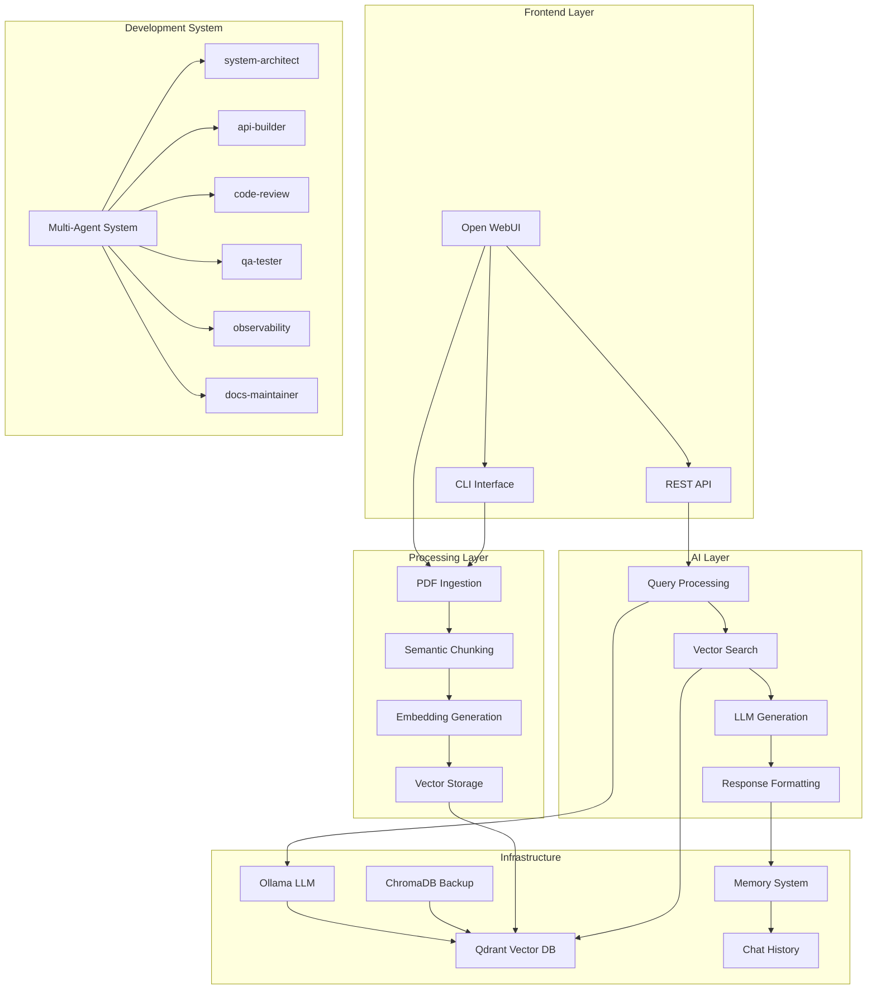
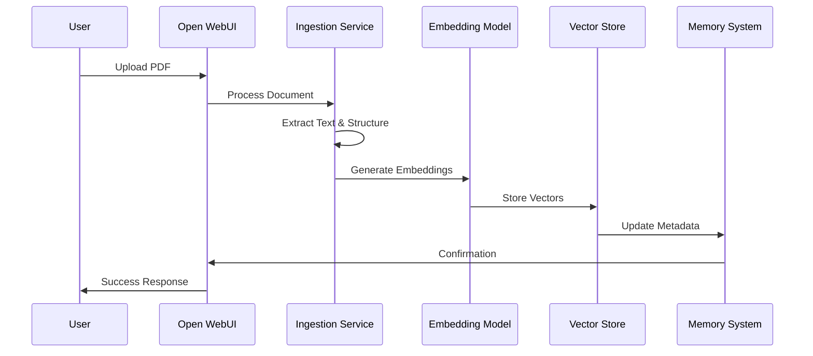
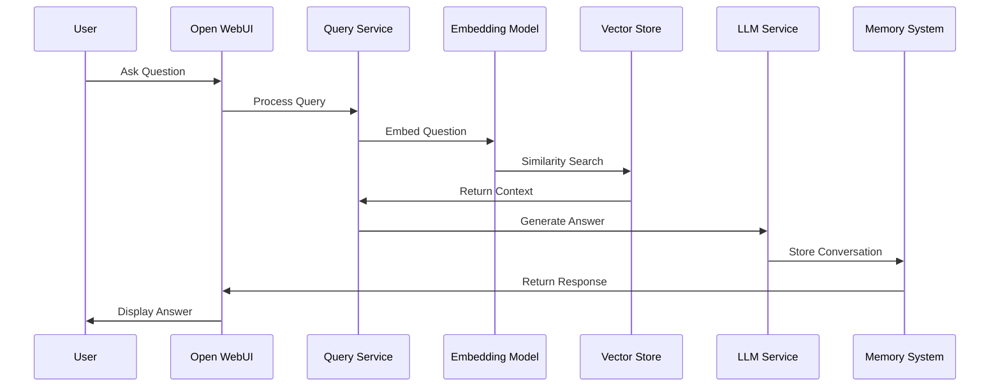
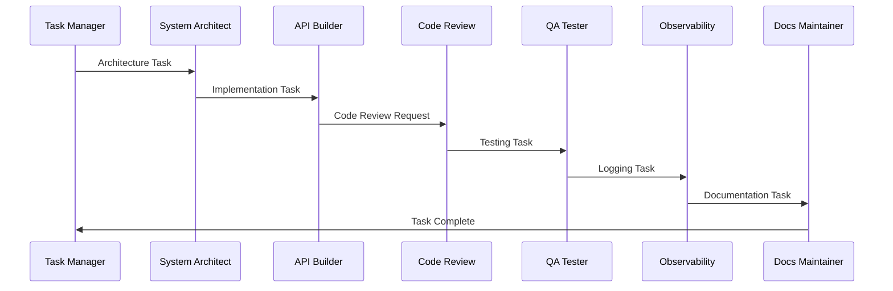

# System Overview

## 🏗️ High-Level Architecture

The PDF Chat Appliance is an enterprise-scale multi-vendor documentation system that combines local LLM inference, vector search, and autonomous AI agents for development and maintenance.

### Core Components

## 🔄 Data Flow Pipelines

### 1. Document Ingestion Pipeline

### 2. Query Processing Pipeline

### 3. Multi-Agent Development Pipeline

## 🧠 Model Configuration

### LLM Stack

- **Embedding Model**: `sentence-transformers:nomic-embed-text-v1.5`
- **Chunking Model**: `ollama:phi3`
- **RAG Completion**: `ollama:mistral`
- **Code Generation**: `gpt-4` or `claude-3-sonnet`
- **Planning**: `mistral` or `gpt-3.5-turbo`

### Vector Storage

- **Primary**: Qdrant (enterprise-grade)
- **Backup**: ChromaDB (local development)
- **Namespacing**: Per-user, per-document, per-session

## 🏢 Enterprise Features

### Multi-Vendor Support

- **Vendor Detection**: Automatic identification of VMware, Cisco, Dell, HPE, etc.
- **Cross-Vendor Intelligence**: Integration guidance across vendor boundaries
- **Vendor-Specific Collections**: Isolated vector storage per vendor
- **Enterprise Metadata**: Rich tagging and categorization

### Scalability Features

- **Large File Processing**: Optimized handling of multi-MB PDFs
- **Semantic Chunking**: Structure-aware document splitting
- **Memory Management**: Efficient vector storage and retrieval
- **Health Monitoring**: Comprehensive system observability

## 🔧 Development Workflow

### Agent Execution Flow

1. **Task Manager**: Validates tasks against `TASK.md`
2. **System Architect**: Designs architecture and structure
3. **API Builder**: Implements core functionality
4. **Code Review**: Enforces quality standards
5. **QA Tester**: Validates functionality
6. **Observability**: Ensures proper logging
7. **Docs Maintainer**: Updates documentation

### Quality Gates

- All code must pass type checking
- Unit tests required for new features
- Documentation must be updated
- Logging must be structured and comprehensive
- Security scans must pass

## 📊 Performance Characteristics

### Expected Performance

- **Ingestion**: ~10MB PDF in 30-60 seconds
- **Query Response**: 2-5 seconds for typical questions
- **Vector Search**: <100ms for similarity matching
- **Memory Usage**: ~2GB RAM for typical deployment
- **Storage**: ~100MB per 1MB of PDF content

### Scalability Limits

- **Concurrent Users**: 50+ simultaneous queries
- **Document Size**: Up to 100MB per PDF
- **Total Storage**: 10GB+ vector database
- **Agent Operations**: 24/7 autonomous operation

## 🔒 Security & Compliance

### Data Protection

- **Local Processing**: All LLM operations local
- **No External Calls**: No data sent to cloud services
- **Encrypted Storage**: Vector data encrypted at rest
- **Access Control**: User-based document isolation

### Audit Trail

- **Structured Logging**: All operations logged
- **Chat History**: Complete conversation persistence
- **Agent Actions**: Full audit trail of autonomous operations
- **Health Monitoring**: Continuous system health tracking
