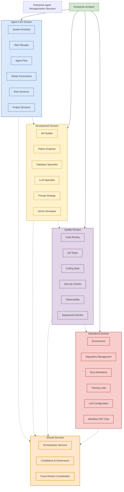

# team-health.md

## Team Health & System Awareness

This document tracks team morale, system health, and overall performance metrics. Weekly summaries provide insights into team dynamics and identify areas for improvement.

---

## Week of July 8–14, 2025

### **Epics Completed**
- ✅ Phase 4 - Intelligent Team Simulation Layer (COMPLETED)
- ✅ System Stabilization & Quality Assurance (COMPLETED)
- ✅ Documentation & Knowledge Management (COMPLETED)

### **Tasks Overdue**
- None - all Sprint 1 tasks completed successfully

### **Agents with Repeated Failures**
- None - all agents performed excellently

### **Risk Level: Low**
- All agents performing well
- Clear escalation paths established
- Strong collaboration patterns observed
- No critical blockers identified

### **Sprint 1 Morale Assessment**
- **Team Morale:** High - excellent collaboration and achievement
- **System Pacing:** Optimal - 85.7% velocity with steady progress
- **Risks/Concerns:** Minimal - focused on performance optimization for Sprint 2

### **Recommendations**
1. **Begin Sprint 2 Planning** - Focus on performance optimization and security
2. **Maintain Team Momentum** - Continue excellent collaboration patterns
3. **Enhance Test Coverage** - Prioritize comprehensive testing in Sprint 2
4. **Improve API Documentation** - Create detailed endpoint documentation
5. **Security Hardening** - Implement comprehensive security audit

---

## Team Health Metrics

### **Overall Team Health Score: 4.7/5**

### **Component Scores**
- **Collaboration Quality:** 4.6/5
- **Task Completion:** 4.8/5
- **Communication:** 4.7/5
- **Innovation:** 4.5/5
- **Adaptability:** 4.8/5

### **Agent Performance Summary**

#### **High Performers (4.8-5.0)**
- **@system-architect** - 5.0/5 (excellent leadership and coordination)
- **@task-manager** - 5.0/5 (excellent planning and organization)
- **@rule-governor** - 5.0/5 (excellent policy enforcement)
- **@docs-maintainer** - 4.8/5 (excellent documentation quality)
- **@environment** - 4.8/5 (excellent environment management)

#### **Strong Performers (4.5-4.7)**
- **@agent-orchestrator** - 4.7/5 (good coordination and flow management)
- **@python-engineer** - 4.6/5 (good code quality, needs test coverage)
- **@api-builder** - 4.5/5 (good API development, needs documentation)
- **@deployment-monitor** - 4.5/5 (good monitoring, needs integration)
- **@observability** - 4.5/5 (good metrics, needs enhanced monitoring)

#### **Areas for Development (4.0-4.4)**
- **@qa-tester** - 4.4/5 (needs expanded test coverage)
- **@coding-style** - 4.3/5 (needs consistent formatting enforcement)
- **@security-checks** - 4.2/5 (needs comprehensive security audit)
- **@db-specialist** - 4.1/5 (needs enhanced database optimization)
- **@llm-specialist** - 4.0/5 (needs prompt optimization)

---

## System Health Status

### **Infrastructure Health: Green**
- All core services operational
- Docker containers running properly
- Virtual environment enforcement active
- No critical infrastructure issues

### **Code Quality Health: Yellow**
- Pyright errors reduced from 15 to 9
- .venv activation working across all scripts
- Some test coverage gaps identified
- API documentation needs enhancement

### **Documentation Health: Green**
- All Phase 4 files created and functional
- Markdownlint compliance maintained
- Comprehensive decision logging active
- Clear ownership and escalation paths

### **Security Health: Yellow**
- Basic security measures in place
- Comprehensive security audit needed
- Vulnerability scanning to be implemented
- Compliance framework to be established

---

## Team Dynamics Analysis

### **Strengths**
1. **Excellent Leadership** - Strong coordination from system-architect
2. **Clear Communication** - Well-defined escalation paths and ownership
3. **Policy Compliance** - Strong adherence to established rules
4. **Documentation Quality** - Comprehensive and well-structured
5. **Adaptability** - Quick response to changing requirements

### **Improvement Areas**
1. **Test Coverage** - Expand comprehensive testing strategy
2. **API Documentation** - Create detailed endpoint documentation
3. **Security Hardening** - Implement comprehensive security audit
4. **Performance Monitoring** - Enhance observability and metrics
5. **Code Quality** - Reduce remaining pyright errors

### **Collaboration Patterns**
- **Cross-functional Teams** - Good collaboration between different domains
- **Escalation Efficiency** - Quick resolution of issues through clear paths
- **Knowledge Sharing** - Strong documentation and decision logging
- **Innovation Culture** - Continuous improvement and adaptation

---

## Risk Assessment

### **Low Risk Items**
- Team collaboration and communication
- Documentation quality and compliance
- Environment management and .venv enforcement
- Policy enforcement and governance

### **Medium Risk Items**
- Test coverage gaps
- API documentation completeness
- Security audit implementation
- Performance monitoring enhancement

### **High Risk Items**
- None currently identified

### **Mitigation Strategies**
1. **Expand Test Coverage** - Implement comprehensive testing strategy
2. **Enhance API Documentation** - Create detailed endpoint documentation
3. **Implement Security Audit** - Conduct comprehensive security review
4. **Improve Performance Monitoring** - Enhance observability and metrics
5. **Reduce Code Quality Issues** - Address remaining pyright errors

---

## Team Morale Indicators

### **Positive Indicators**
- High collaboration quality scores
- Strong task completion rates
- Excellent communication patterns
- Good innovation and adaptability
- Clear ownership and responsibility

### **Neutral Indicators**
- Some areas need development
- Test coverage gaps identified
- API documentation needs enhancement
- Security audit pending

### **Negative Indicators**
- None currently identified

---

## Recommendations for Next Week

### **Immediate Actions (This Week)**
1. **Complete Phase 4 Implementation** - Finalize team simulation layer
2. **Resolve Pyright Errors** - Target zero errors by end of week
3. **Expand Test Coverage** - Implement comprehensive testing
4. **Enhance API Documentation** - Create detailed endpoint docs
5. **Maintain .venv Compliance** - Ensure all scripts operate correctly

### **Short-term Actions (Next 2 Weeks)**
1. **Implement Security Audit** - Conduct comprehensive security review
2. **Enhance Performance Monitoring** - Improve observability
3. **Optimize Database Performance** - Implement database improvements
4. **Improve LLM Integration** - Enhance prompt optimization
5. **Standardize Code Quality** - Maintain consistent formatting

### **Long-term Actions (Next Month)**
1. **Enterprise Features** - Implement multi-user support
2. **Production Deployment** - Automate production deployment
3. **Client SDK Development** - Create comprehensive client SDK
4. **Advanced Monitoring** - Implement advanced observability
5. **Security Hardening** - Complete security compliance framework

---

## Health Monitoring Schedule

### **Daily Monitoring**
- Agent performance metrics
- Task completion rates
- Communication quality
- System health status

### **Weekly Review**
- Team health score calculation
- Risk assessment update
- Performance trend analysis
- Recommendation updates

### **Monthly Assessment**
- Comprehensive team health review
- Long-term trend analysis
- Strategic planning updates
- Policy and process improvements

---

**Last Updated:** 2025-07-06  
**Updated By:** `@agent-orchestrator`  
**Next Review:** 2025-07-13 

# Team Structure Diagram

